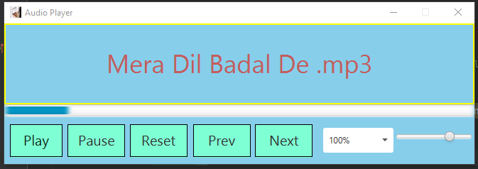

# Audio-Player
A Simple Audio Player, created with **JavaFx**, with help of Scene Builder.    

## Screenshots
## Screenshots
User Interface
:-------------------------:|

## Features
- You can play next or previous file.
- You can Pause & Play the .mp3 file.
- You can reset the running .mp3 file.
- You can change speed and control volume of the .mo3 file.
 

## Installation 🔌
1. Press the **Fork** button (top right the page) to save copy of this project on your account.

2. Download the repository files (project) from the download section or clone this project in your PC by using clone command or downloading zip file.

3. Imported it in Intellij IDEA or any other Java IDE.

4. Run the application :D

## Contributing 💡
If you want to contribute to this project and make it better with new ideas, your pull request is very welcomed.
If you find any issue just put it in the repository issue section, Thank you.

.سبحَانَكَ اللَّهُمَّ وَبِحَمْدِكَ، أَشْهَدُ أَنْ لا إِلهَ إِلأَ انْتَ أَسْتَغْفِرُكَ وَأَتْوبُ إِلَيْكَ
